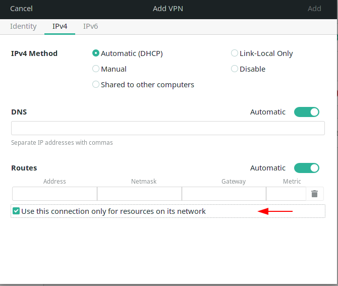

# Sophos SSL VPN Client for GNU/Linux


Step 1: Add VPN.


Step 2: Identity > "Gateway:" add Remote IP or domain.


Step 3: On IPv4, click "Use this connection only for resources on its network".



Step 4: Check setting in file ovpn. "remote [IP or Domain] 8443" view example config in Step 7.


Step 5: View example config in Step 7.


Step 6: Extract the certificate and key from .ovpn file. Download from repository [script](https://gist.github.com/dleonard00/fa482b4e803bf1f905526275c116c6d8)
```
Execute:
explode-opvn.sh file.ovpn
```


Step 7: example ovpn config.


